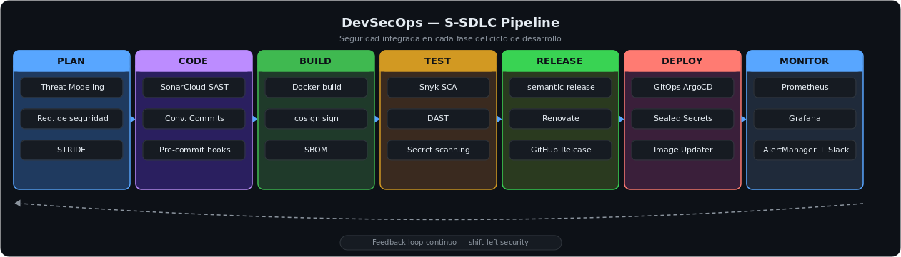

<h1 align="center">DevSecOps</h1>

<p align="center">
  
  
  
  
</p>

---

## Sobre este módulo

Cuatro labs encadenados que construyen un pipeline DevSecOps real de punta a punta: **SAST** (SonarCloud), **SCA + gestión de dependencias** (Snyk + Renovate), **supply chain security** (firma de imágenes con cosign/Sigstore), **GitOps** (ArgoCD + Image Updater) y **observabilidad con autoescalado** (Prometheus/Grafana/AlertManager + KEDA). Filosofía **shift-left**: la seguridad es un gate automático en cada fase, no una auditoría al final.

---

## Pipeline completo

```
1. Push (conventional commit) ─▶ 2. CI: Linter → Tests → SonarCloud (SAST) → Snyk (SCA) → cosign (firma)
                                            │  falla si hay hallazgo crítico → bloquea merge
                                            ▼
3. semantic-release determina versión ─▶ 4. Build imagen Docker multi-arch (amd64/arm64) → push a registry
                                            ▼
5. ArgoCD Image Updater detecta la nueva imagen (poll cada 2 min)
                                            ▼
6. Commitea el nuevo tag en el repo Helm (GitOps) ─▶ 7. ArgoCD sincroniza el cluster → rolling deploy
                                            ▼
8. Prometheus scrapea métricas → Grafana dashboards → AlertManager → Slack
9. HPA (CPU/memoria) y KEDA (eventos, ej. cola RabbitMQ) autoescalan según carga
```



*Marco S-SDLC de referencia: dónde encaja cada control de seguridad en el ciclo de desarrollo. Los labs de este repositorio implementan la columna práctica —SonarCloud (SAST), Snyk (SCA), cosign/SBOM, ArgoCD (GitOps) y Prometheus/KEDA—; el threat modeling (fase PLAN) y el DAST (fase TEST) se incluyen como parte del framework completo, no se implementaron en estos labs.*

---

## Lab 1 — SAST + gestión de dependencias + firma

- **SonarCloud** analiza el código estáticamente (bugs, vulnerabilidades, code smells) sin ejecutarlo; comparación configurada contra la versión anterior (`sonar.leak.period`).
- **Renovate** abre PRs automáticas cuando hay dependencias desactualizadas (ej. bump de `pylint` con changelog incluido).
- **cosign** (Sigstore) firma las imágenes Docker — claves generadas y subidas automáticamente como GitHub Secrets (`COSIGN_PASSWORD`, `COSIGN_PRIVATE_KEY`, `COSIGN_PUBLIC_KEY`).

## Lab 2 — SCA con Snyk

El **SCA** (*Software Composition Analysis*) escanea las dependencias de terceros del proyecto en busca de vulnerabilidades conocidas (CVEs) — la mayoría del código de una app moderna son librerías ajenas. Snyk se integra como job de CI:

```yaml
- name: Security Snyk Checks
  uses: snyk/actions/python@master
  env:
    SNYK_TOKEN: ${{ secrets.SNYK_TOKEN }}
  with:
    args: --severity-threshold=high
```

Flujo verificado end-to-end: push con dependencia vulnerable → el job **falla** y bloquea el merge → hallazgo visible en `Security → Code scanning` → rama de fix → PR → workflow pasa → merge.

## Lab 3 — GitOps con ArgoCD

**GitOps** significa gestionar el despliegue declarándolo en Git: el repositorio es la única fuente de verdad del estado deseado del cluster, y una herramienta (ArgoCD) se encarga de que el cluster real coincida siempre con lo que dice el repo. Dos repos separados (best practice): uno de código (app + Dockerfile + workflows) y uno GitOps (Helm chart `values.yaml`). El **ArgoCD Image Updater** monitorea el registry cada 2 minutos y commitea el nuevo tag al repo GitOps automáticamente; ArgoCD sincroniza el cluster con ese estado. Secretos gestionados con **Sealed Secrets** (cifrados con `kubeseal`, seguros de commitear en Git).

```
[INFO] Setting new image to user/app:1.0.2
[INFO] Successfully updated image '...1.0.1' to '...1.0.2'
[INFO] git push origin main   ← commitea el nuevo tag al repo GitOps
```

## Lab 4 — Observabilidad y autoescalado

Stack `kube-prometheus-stack` (Prometheus + Grafana + AlertManager) desplegado con Helm sobre minikube. Autoescalado verificado con **HPA** (CPU/memoria, hasta 100 réplicas) y **KEDA** (escalado por eventos — ej. profundidad de cola en RabbitMQ, con capacidad de escalar desde 0 pods). Alertas de Slack configuradas y disparadas en pruebas de estrés reales sobre un pod.

---

## Código propio en este repositorio

| Archivo | Qué hace |
|---|---|
| [`ci-sonarcloud.yaml`](ci-sonarcloud.yaml) | Workflow de CI: lint (pre-commit) → tests con cobertura → SonarCloud SAST, encadenados con `needs` |
| [`lint-snyk.yaml`](lint-snyk.yaml) | Job "Security Snyk Checks": escanea dependencias y sube el SARIF a GitHub Code Scanning |
| [`release-cosign-sbom.yaml`](release-cosign-sbom.yaml) | Workflow de release: semantic-release → build multi-arch → firma con cosign → verificación → generación y publicación de SBOM |
| [`Dockerfile`](Dockerfile) | Imagen mínima (`python:3.8-alpine`) con healthcheck propio |

---

## Stack

`GitHub Actions` · `SonarCloud` · `Snyk` · `Renovate` · `cosign / Sigstore` · `ArgoCD + Image Updater` · `Helm` · `Sealed Secrets` · `Prometheus / Grafana / AlertManager` · `KEDA` · `Docker`

---

## Objetivos cumplidos

- [x] SAST (SonarCloud) y SCA (Snyk) integrados como gates que bloquean el merge ante hallazgos críticos
- [x] Gestión automática de dependencias (Renovate) y firma de imágenes (cosign) en el pipeline
- [x] GitOps completo con ArgoCD: Image Updater + Helm + Sealed Secrets
- [x] Observabilidad (Prometheus/Grafana) con alertas accionables a Slack
- [x] Autoescalado verificado por CPU/memoria (HPA) y por eventos (KEDA)

---

## Errores comunes evitados

- **Dejar la seguridad para el final del pipeline** — el shift-left existe porque un fallo en producción cuesta mucho más que uno detectado en la fase de código.
- **Ignorar los hallazgos de SAST/SCA** — un escáner que nadie atiende genera ruido y falsa sensación de seguridad; los hallazgos críticos deben bloquear el merge.
- **Secretos en el repositorio** — claves y tokens van en gestores de secretos (Sealed Secrets); un secreto en el historial de git es un secreto comprometido.
- **Deploy key de solo lectura en ArgoCD Image Updater** — sin permiso de escritura (`-w`), Image Updater no puede commitear el nuevo tag al repo GitOps.
- **Confundir `mikefarah/yq` con `kislyuk/yq`** — sintaxis incompatible entre las dos versiones; si `yq e` imprime la ayuda de `jq`, es la versión equivocada.

---

## Módulos relacionados

- **[Criptografía](https://github.com/juanmalbran/Criptografia)** — cosign/Sigstore para firma de imágenes y Sealed Secrets en Kubernetes.
- **[IA y Ciberseguridad](https://github.com/juanmalbran/IA-y-Ciberseguridad)** — asegurar pipelines de MLOps aplica los mismos principios de shift-left.
- **[Blue Team](https://github.com/juanmalbran/Blue-Team)** — kube-prometheus-stack y AlertManager como monitoring operacional.

---

<div align="center">
  <sub>Parte del portfolio de <a href="https://github.com/juanmalbran">Juan Malbrán · M4LBYTE</a></sub>
</div>
